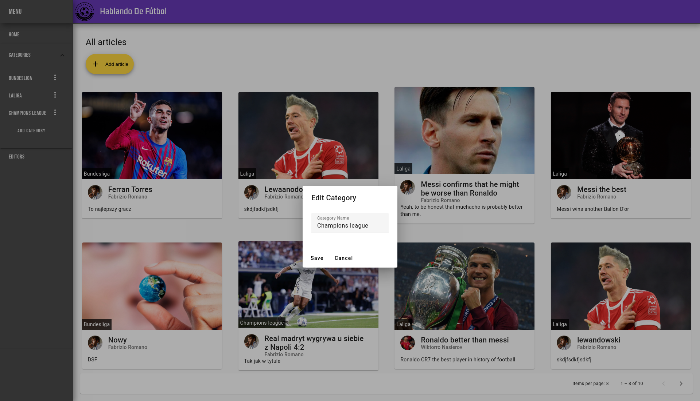

# Hablando De Fútbol

Full-stack aplication created as a group project for the Software Testing subject during Computer Science studies.

The app is a football content blog.

## Features
* Landing page with an article list that uses pagination
* Article details pages
* Reading and adding comments for each article
* Reacting to comments by giving thumbs up and down
* List of categories
* Showing articles included in a particular category
* List of editors

## Technology stack

### FrontEnd

* Angular 17
* TypeScript
* SCSS
* Angular Material
* RXJS
* ESlint-Prettier
* For tests:
    * Cypress
    * Selenium

### BackEnd

* Java 17
* SpringBoot
* Maven
* Lombok
* Jackson
* Docker
* PostGres SQL,
* Swagger
* For tests:
    * JUnit 5
    * Cucumber
    * H2
    * JMH

## Makefile commands

You can start Docker just by using `make` command.

## Screenshots

* Home page - article list page,

    

* Article details page,

    

* Comments in article details page,

    

* Create article page,

    

* Edit article page,

    

* Category list in sidebar,

    

* Edit catagory dialog,

    

* Article list page showing articles for particular category,

    

* Editor list page,

    

* Create editor page,

    

* Edit editor page,

    

